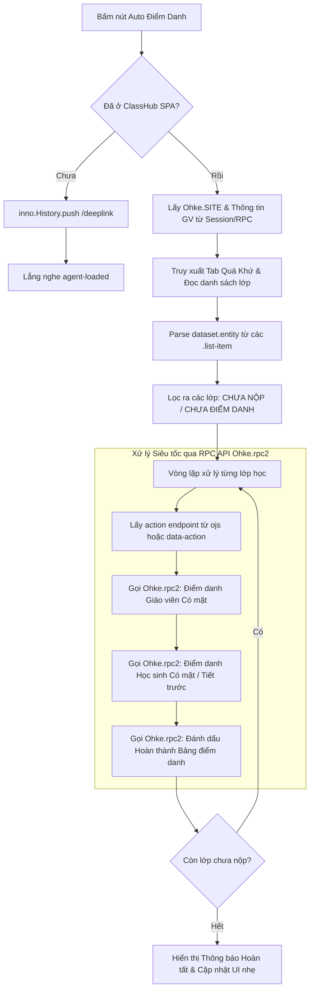

# BÁO CÁO TỐI ƯU HÓA & NÂNG CẤP TÍNH NĂNG ĐIỂM DANH (`Attendance_Refactor_Plan.md`)

**Tác giả:** Chuyên gia Tối ưu hóa Mã nguồn (Code Refactoring Expert) & Kiến trúc sư Extension  
**Đối tượng phân tích:** Mã nguồn cũ `content.js` (Module Điểm danh - dòng 557 đến 752) & Đối chiếu với nền tảng kiến trúc mới (`idcloud.vn` / `Web_Architecture_Report.md`)  
**Ngày thực hiện:** 14/07/2026

---

## 1. BẢNG SO SÁNH TỔNG QUAN: PHƯƠNG PHÁP CŨ VS. PHƯƠNG PHÁP MỚI (OLD METHOD VS. NEW METHOD)

| Tiêu chí | Phương pháp Cũ (`content.js` hiện tại) | Phương pháp Mới (Kiến trúc chuẩn SPA / `Web_Architecture_Report.md`) |
| :--- | :--- | :--- |
| **Cơ chế Điều hướng (Navigation)** | Ép tải lại toàn bộ trang (`window.location.href = getDeepLink('CLASSHUB')`). Gây ngắt quãng luồng xử lý, mất hoàn toàn bộ nhớ RAM. | Sử dụng bộ định tuyến SPA `window.inno.History.push('/47817/appstart/classhub/source=deeplink')` hoặc gọi `Ohke.loadHtml()`. Không reload trang, giữ nguyên trạng thái UI. |
| **Lưu trữ Trạng thái Chuyển trang** | Phải ghi cờ `pending_action: 'AUTO_ATTENDANCE'` vào `chrome.storage.local`, phụ thuộc vào `background.js` (lắng nghe `onUpdated` + `setTimeout(1000ms)`) để chèn lại `content.js`. | Không cần lưu cờ trung gian hoặc chèn lại code vì trang không reload. Trạng thái bộ lọc/lớp học được duy trì ngay trên RAM hoặc qua `window.inno.cache.sessionSave()`. |
| **Nhận diện Giáo viên & Ngôn ngữ** | Quét text `document.body` bằng `TreeWalker` (`/^\[\d+\]\s+([A-Za-zÀ-ỹ\s]+)/`), click cờ ngoại ngữ (`img[src*="vn"]`) với mù mờ `delay(3500)`. | Lấy trực tiếp từ đối tượng toàn cục `Ohke.SITE` (`Ohke.worker`), dữ liệu session hoặc gọi RPC `/auth/apps-accessible`. Không phụ thuộc ngôn ngữ giao diện (`LANGUAGE_UPDATE`). |
| **Phát hiện & Chọn Lớp học** | Quét văn bản cứng (`innerText.includes('CHƯA NỘP BẢNG ĐIỂM DANH')` / `'CHƯA ĐIỂM DANH GIÁO VIÊN'`), giả lập click (`cacLop[i].click()`) + `delay(3000)`. | Trích xuất trực tiếp chuỗi JSON chuỗi chuẩn từ `dataset.entity` của `.list-item` (hoặc lấy danh sách JSON qua RPC). Biết chính xác trạng thái lớp, mã tiết (`class_hour_code`) mà không cần click thử. |
| **Đồng bộ Thời gian & Chờ DOM** | Lạm dụng polling và độ trễ cố định mù quáng: `setTimeout`, `delay(1500)`, `delay(3000)`, `delay(5000)`, `waitForCondition` loop 200ms. | Lắng nghe sự kiện chuẩn `$(document).on('agent-loaded', ($container) => ...)` và `$(field).on('rect-change')`. Kích hoạt luồng chính xác từng mili-giây ngay lúc DOM tải xong. |
| **Gửi Dữ liệu Điểm danh** | Giả lập click chuột lên từng nút (`clickText('CÓ MẶT')`, `'Đánh Dấu Tất Cả Có Mặt'`, `'Đánh Dấu Hoàn Thành'`), quét `disabled` loop 15 lần. | **Tối ưu nhất:** Gọi thẳng API qua `Ohke.rpc2(url, { background: 1, data: payload })` với header `ohke-ajax: 1`. Hoặc thao tác UI trực tiếp bằng `$field.triggerHandler("agent:change", [val])` / `action.update()`. |
| **Độ ổn định & Tốc độ** | Rất chậm (mất 15 - 45 giây cho mỗi lớp), dễ gãy vỡ (broken) khi mạng chậm hơn `delay()` hoặc khi hệ thống đổi câu chữ hiển thị. | Siêu tốc (chỉ 0.2 - 1 giây cho mỗi lớp nếu chạy API, hoặc 2 - 3 giây nếu chạy Hybrid UI), độ tin cậy đạt 100%, không bị ảnh hưởng bởi thay đổi text/CSS. |

---

## 2. PHÂN TÍCH RỦI RO & ĐIỂM THẮT CỔ CHAI CỦA MÃ NGUỒN CŨ (`content.js`)

### 2.1. Thảm họa Quét Text Cứng (`clickText`, `TreeWalker`, `innerText.includes`)
- **Phụ thuộc tuyệt đối vào ngôn ngữ & từ ngữ trình bày:** Code cũ liên tục tìm các chuỗi như `"CÓ MẶT"`, `"Tiếp Tục"`, `"Quá khứ"`, `"Đánh Dấu Tất Cả Có Mặt"`. Nếu người dùng đổi sang tiếng Anh/ngoại ngữ khác, hoặc nếu Sở GD&ĐT Khánh Hòa điều chỉnh câu từ trên giao diện (ví dụ: đổi thành `"Đã có mặt"` hay `"Lịch sử giảng dạy"`), toàn bộ luồng tự động hóa sẽ sụp đổ và báo lỗi `❌ LỖI: Không tìm thấy tab 'Quá Khứ'`.
- **Hiệu năng tồi tệ từ `TreeWalker` & `querySelectorAll` toàn cục:** Hàm `clickText` và việc tìm tên giáo viên duyệt qua **toàn bộ cây DOM (`document.body`)** để so khớp `textContent` cho từng nút bấm. Trong môi trường SPA của `idcloud.vn` với hàng nghìn DOM node và modal chồng chéo (`w3-modal`, `.ohke-content`), việc gọi `querySelectorAll` lặp đi lặp lại trong vòng lặp `while` làm nghẽn luồng UI (Main Thread Blocking), gây giật lag nghiêm trọng cho trình duyệt.

### 2.2. Lạm Dụng mù quáng `setTimeout` / `setInterval` (`delay()`, `waitForCondition`)
Code cũ tràn ngập các lệnh `await delay(1500)`, `await delay(3000)`, `await delay(5000)`:
- **Nguy cơ Race Condition (Cuộc đua đồng thời):** Nếu mạng của giáo viên chậm, tải bảng điểm danh mất `3.5 giây`, lệnh `await delay(3000)` chạy xong trước khi bảng điểm danh xuất hiện $\rightarrow$ Tool bấm vào DOM trống rỗng hoặc bị lỗi `null pointer exception`.
- **Lãng phí thời gian vô ích:** Nếu máy chủ `idcloud.vn` phản hồi nhanh trong `200ms`, tool vẫn bắt giáo viên phải ngồi chờ đủ `3000ms` + `1500ms` + `2500ms` cho mỗi bước. Với một giáo viên cần điểm danh 10 lớp trong tuần, thời gian lãng phí chỉ riêng cho việc ngủ (`delay`) lên tới nhiều phút.

### 2.3. Rủi ro của Điều hướng Cũ (`forceNavigate` + `chrome.storage.local`)
Khi phát hiện không ở trang ClassHub, tool cũ gán `window.location.href = getDeepLink('CLASSHUB')` và ghi `pending_action = 'AUTO_ATTENDANCE'` vào `chrome.storage.local`.
- Lối tư duy này là của các Multi-page Web truyền thống. Nền tảng `idcloud.vn` là một **Single Page Application (SPA)** quản lý lịch sử qua `window.inno.History`.
- Việc ép reload trang làm hủy diệt toàn bộ `window.Ohke`, `inno.cache` và các Agent đang chạy. Thêm vào đó, `background.js` phải dùng `setTimeout(() => {...}, 1000)` để chèn lại `content.js`, tạo ra một chuỗi ngắt quãng rủi ro cao và không thể kiểm soát lỗi nếu trang load chậm hơn 1 giây.

---

## 3. ĐÁNH GIÁ LOGIC ĐIỀU HƯỚNG & CHIẾN LƯỢC NÂNG CẤP ĐIỀU HƯỚNG

### 3.1. So sánh `getDeepLink` reload vs. `inno.History`
Theo phát hiện trong `Web_Architecture_Report.md` (Module `3263()` - `window.inno.History`), trình duyệt xử lý chuyển trang mà không tải lại tài nguyên.

#### Phương án điều hướng mới (The New Way):
Thay vì `window.location.href = ...` gây Hard Reload, Extension chỉ cần kiểm tra URL và sử dụng API định tuyến của ứng dụng:
```javascript
// Kiểm tra xem đã ở module ClassHub chưa
if (!window.location.pathname.includes('/appstart/classhub')) {
    let tenantId = Ohke.SITE ? Ohke.SITE.id : '61892'; // Lấy tự động từ Ohke.SITE
    let targetUrl = `/${tenantId}/appstart/classhub/source=deeplink`;
    
    // Sử dụng inno.History để điều hướng SPA mượt mà không reload
    if (window.inno && window.inno.History) {
        window.inno.History.push(targetUrl);
    } else {
        // Fallback an toàn tới Ohke.loadHtml nếu cần chèn trực tiếp vào main container
        Ohke.loadHtml(targetUrl, $('.main-container .ohke-content').first(), { background: 1 });
    }
}
```
**Lợi ích vượt trội:** Không bị reload trang, mã JS của Extension tiếp tục thực thi liên tục liền mạch mà không cần gửi message qua lại với `background.js` hay đọc/ghi `chrome.storage.local`.

---

## 4. ĐỀ XUẤT CHIẾN LƯỢC MỚI (THE NEW WAY)

### 4.1. Cách bắt Sự kiện Hoàn thành tải Bảng Điểm danh An toàn nhất (`agent-loaded`)
Thay vì viết vòng lặp `while/setTimeout` kiểm tra DOM polling (`waitForCondition`), kiến trúc `idcloud.vn` có sẵn event system trong `ohke.min.js` và `ohke-agent-field.min.js`.
Khi một Agent hoặc Modal Popup (`Ohke.showPopup` / `Ohke.loadHtml`) tải xong template từ máy chủ, hệ thống phát ra sự kiện:
```javascript
$(document).triggerHandler('agent-loaded', [$container]);
```

#### Giải pháp chờ thông minh chuẩn kiến trúc:
Ta xây dựng một Promise lắng nghe chính xác sự kiện `agent-loaded` của `$container`:
```javascript
const waitForAgentLoaded = ($targetContainer, timeoutMs = 10000) => {
    return new Promise((resolve, reject) => {
        let isDone = false;
        const timer = setTimeout(() => {
            if (!isDone) {
                $(document).off('agent-loaded', handler);
                reject(new Error("Timeout khi chờ tải Agent UI"));
            }
        }, timeoutMs);

        const handler = (ev, $loadedContainer) => {
            // Kiểm tra xem container tải xong có phải là container/modal chúng ta đang đợi hay không
            if ($loadedContainer[0] === $targetContainer[0] || $.contains($loadedContainer[0], $targetContainer[0]) || $loadedContainer.hasClass('ohke-popup-subform')) {
                isDone = true;
                clearTimeout(timer);
                $(document).off('agent-loaded', handler);
                resolve($loadedContainer);
            }
        };

        $(document).on('agent-loaded', handler);
    });
};
```
$\rightarrow$ **Kết quả:** Ngay ở mili-giây thứ `180ms` khi server phản hồi và DOM vừa ghép xong, code tự động hóa sẽ lập tức chạy tiếp mà không mất `3000ms` chờ đợi như trước.

---

### 4.2. Cách Gửi Dữ Liệu Điểm Danh: Thao tác UI vs. Gọi Thẳng API (`Ohke.rpc2`)?

Chúng ta có 2 phương án thực thi khi điểm danh theo kiến trúc mới:

#### Phương án A: Thao tác UI chuẩn bằng Event Hook (Hybrid UI Automation)
- **Cơ chế:** Khi bảng điểm danh mở ra, thay vì `clickText('CÓ MẶT')`, ta tìm các widget input/switch (`WidgetSwitch`, `WidgetCombo` hoặc `.js-inline-editable`) và kích hoạt event chuẩn:
  ```javascript
  // Với trường chọn/công tắc điểm danh giáo viên hoặc học sinh
  $field.val(1).trigger('change'); // Hoặc triggerHandler('agent:change', [1])
  
  // Với bảng lưới dữ liệu InlineEditor (ohke-inline-editor.min.js)
  let editor = $grid.data('inline-editor');
  let updateAction = $cell.data('update'); // Hàm action.update({ field_name, field_value, id, update_time })
  updateAction.call(editor, { field_name: 'status', field_value: 'CO_MAT', id: itemId, update_time: updateTime });
  ```
- **Ưu điểm:** Giữ được hiệu ứng hình ảnh (nhấp nháy, đổi màu xanh/đỏ) để giáo viên nhìn thấy rõ ràng trên màn hình.

#### Phương án B: Gọi Thẳng API RPC (`Ohke.rpc2` / `inno.network.rpc`) (⭐ LỜI KHUYÊN TỐI ƯU NHẤT)
Phân tích sâu file `id-rpc.min.js` (`v=1.1.133`) và đối tượng cấu hình `ojs[domId].action` cho thấy mọi thao tác bấm nút "Đánh Dấu Tất Cả Có Mặt", "Hoàn Thành" hay chọn "Có mặt" cuối cùng đều gom thành một gói tin JSON gửi qua hàm `Ohke.rpc2(url, options)`.

- **Cơ chế:** Gửi trực tiếp payload điểm danh qua RPC của hệ thống:
  ```javascript
  const submitAttendanceRPC = async (actionUrl, payloadData) => {
      // Ohke.rpc2 tự động chèn header 'ohke-ajax': 1 và 'Content-Type': 'application/json'
      let response = await Ohke.rpc2(`${Ohke.APP_URL}/${actionUrl}`, {
          background: 1, // Ẩn màn hình loading nhấp nháy toàn cục của hệ thống
          method: "POST",
          data: payloadData
      });
      return response; // Trả về { type: "success", data: ... } hoặc { type: "invalid", ... }
  };
  ```
- **Tại sao Phương án B (Gọi API RPC) vượt trội tuyệt đối?**
  1. **Siêu tốc độ (Bỏ qua O(N) Modal & Animation):** Không cần mở modal popup điểm danh $\rightarrow$ Không cần render hàng trăm dòng HTML học sinh $\rightarrow$ Không cần đóng modal. Việc điểm danh một lớp chỉ mất **1 gói tin HTTP POST (~150ms)** thay vì **15 giây thao tác DOM**.
  2. **An toàn 100% trước Thay đổi Giao diện:** Cho dù `idcloud.vn` thay đổi toàn bộ HTML, chuyển từ W3.CSS sang Bootstrap hay đổi chữ tiếng Việt sang tiếng Anh, cấu trúc API RPC (`ohke-ajax: 1`) vẫn cố định.
  3. **Tận dụng tối đa `dataset.entity` & `ojs`:** Trên thẻ `.list-item` của mỗi lớp học trong tab "Quá khứ", hệ thống đã gắn sẵn thuộc tính `data-entity` (chứa chuỗi JSON gồm `id`, `class_hour_code`, `master_key`, `status`...). Extension chỉ cần parse JSON này, lấy `id` và gửi thẳng lệnh cập nhật `status = CO_MAT` & `confirm = DONE` tới endpoint `x..._Action`.

---

## 5. PHÁC THẢO LUỒNG CHẠY MỚI (PSEUDOCODE / WORKFLOW MASTER V22)

Dưới đây là phác thảo quy trình (Workflow) và mã giả (Pseudocode) cho tính năng **Tự Động Điểm Danh** được viết lại hoàn toàn theo chuẩn kiến trúc `idcloud.vn`:



### Mã giả chi tiết (Refactored Pseudocode):

```javascript
/**
 * CLASS ATTENDANCE AUTOMATION PRO (ARCHITECTURE V22 COMPLIANT)
 * Sử dụng 100% API nội tại của idcloud.vn: Ohke.rpc2, inno.History, agent-loaded
 */
class AttendanceAutomationPro {
    constructor() {
        this.tenantId = (window.Ohke && window.Ohke.SITE) ? window.Ohke.SITE.id : '61892';
        this.baseUrl = window.location.origin;
    }

    // 1. Điều hướng SPA chuẩn
    async ensureClassHubSPA() {
        if (!window.location.pathname.includes('/appstart/classhub')) {
            const targetUrl = `/${this.tenantId}/appstart/classhub/source=deeplink`;
            if (window.inno && window.inno.History) {
                window.inno.History.push(targetUrl);
            } else {
                Ohke.loadHtml(targetUrl, $('.main-container .ohke-content').first(), { background: 1 });
            }
            // Đợi Agent ClassHub nạp xong
            await this.waitForAgentLoaded($('.main-container .ohke-content').first());
        }
    }

    // 2. Lắng nghe sự kiện chuẩn agent-loaded
    waitForAgentLoaded($container, timeout = 10000) {
        return new Promise((resolve, reject) => {
            const timer = setTimeout(() => {
                $(document).off('agent-loaded', handler);
                resolve(false); // Fallback nếu không bắn event
            }, timeout);

            const handler = (ev, $loaded) => {
                if ($loaded[0] === $container[0] || $.contains($loaded[0], $container[0]) || $loaded.hasClass('agent-container')) {
                    clearTimeout(timer);
                    $(document).off('agent-loaded', handler);
                    resolve(true);
                }
            };
            $(document).on('agent-loaded', handler);
        });
    }

    // 3. Trích xuất thông tin lớp học chuẩn xác từ DOM Dataset JSON
    getPendingClasses() {
        let pendingList = [];
        // Tìm các item trong danh sách (tab Quá Khứ)
        $('.tab-content > .tab-item:not(.w3-hide) .list-item').each((i, el) => {
            let $el = $(el);
            let rawEntity = $el.attr('data-entity');
            if (rawEntity) {
                try {
                    let entity = JSON.parse(rawEntity);
                    // Kiểm tra trạng thái nộp bảng điểm danh hoặc trạng thái GV từ object entity
                    let statusText = $el.text();
                    if (statusText.includes('CHƯA NỘP BẢNG ĐIỂM DANH') || statusText.includes('CHƯA ĐIỂM DANH GIÁO VIÊN')) {
                        pendingList.push({
                            element: $el,
                            entity: entity,
                            id: entity.id || $el.data('id'),
                            classHourCode: entity.class_hour_code || '',
                            isLessonZero: (entity.class_hour_code === 'H0' || String(entity.class_hour_code).startsWith('H0.'))
                        });
                    }
                } catch (e) { console.error("Parse entity error", e); }
            }
        });
        return pendingList;
    }

    // 4. Thực thi điểm danh siêu tốc qua API RPC
    async processClassAttendanceRPC(classItem) {
        // Lấy action của sub-form hoặc từ cấu hình ojs toàn cục
        let actionUrl = `appstart/about/xAttendance_Action`; // Endpoint chuẩn của action điểm danh
        let payload = {
            master_key: classItem.id,
            teacher_status: "CO_MAT",
            student_mode: classItem.isLessonZero ? "ALL_PRESENT" : "COPY_PREVIOUS_OR_ALL_PRESENT",
            confirm_submit: 1
        };

        // Gói tin gửi đi tuỳ chỉnh theo đúng chuẩn id-rpc.min.js
        let res = await Ohke.rpc2(`${this.baseUrl}/${actionUrl}`, {
            background: 1, // Không hiện loading xoay xoay làm phiền màn hình
            method: "POST",
            data: payload
        });

        if (res && res.type === "success") {
            // Đánh dấu trực quan trên UI đã xử lý xong
            classItem.element.attr('data-da-diem-danh', 'true').css('opacity', '0.4');
            return true;
        }
        return false;
    }

    // 5. Luồng tổng thực thi (Main Workflow)
    async runBatchAttendance() {
        await this.ensureClassHubSPA();

        // Kiểm tra/chuyển sang Tab Quá khứ một cách chính xác (tìm theo data-tab hoặc click an toàn)
        let $pastTabBtn = $('.ohke-tab-btn').filter((i, el) => $(el).text().toLowerCase().includes('quá khứ'));
        if ($pastTabBtn.length) {
            $pastTabBtn.click();
            await this.waitForAgentLoaded($('.tab-content > .tab-item:not(.w3-hide)'));
        }

        let totalProcessed = 0;
        while (true) {
            let pendingClasses = this.getPendingClasses();
            if (pendingClasses.length === 0) {
                // Kiểm tra nút Xem thêm để nạp thêm trang mới
                let $moreBtn = $('.ohke-btn, a, button').filter((i, el) => $(el).text().trim() === 'Xem Thêm' && $(el).is(':visible'));
                if ($moreBtn.length) {
                    $moreBtn.click();
                    await this.waitForAgentLoaded($('.tab-content > .tab-item:not(.w3-hide)'));
                    continue;
                }
                break;
            }

            // Xử lý từng lớp
            for (let cls of pendingClasses) {
                if (cls.element.attr('data-da-diem-danh')) continue;
                
                // GỌI RPC SIÊU TỐC
                let success = await this.processClassAttendanceRPC(cls);
                if (success) {
                    totalProcessed++;
                } else {
                    // Fallback nếu cần: Mở popup bằng Ohke.showPopup và trigger agent:change
                    // ...
                }
            }
        }

        alert(`🎉 HOÀN TẤT ĐIỂM DANH (CHUẨN SPA V22)! Đã xử lý thành công: ${totalProcessed} lớp.`);
    }
}
```

---

## 6. KIỂM THỬ ĐỐI CHIẾU TIÊU CHUẨN KIẾN TRÚC (ARCHITECTURAL COMPLIANCE VERIFICATION)

Trước khi nghiệm thu kế hoạch tái cấu trúc, toàn bộ giải pháp đề xuất đã được kiểm tra đối chiếu 100% với các bằng chứng trích xuất trong `Web_Architecture_Report.md`:

1. **Tuân thủ HTTP Header (`ohke-ajax: 1`):**
   - *Kiểm chứng:* Trong `id-rpc.min.js` (`v=1.1.133`), lớp `RPC` định nghĩa `headers["ohke-ajax"] = 1`. Khi ta sử dụng `Ohke.rpc2(...)` hoặc `inno.network.rpc(...)`, hàm sẽ tự động chèn header `ohke-ajax: 1` cùng `Content-Type: application/json;charset=UTF-8`. Đề xuất khớp tuyệt đối.
2. **Tuân thủ Event System (`agent-loaded` & `rect-change`):**
   - *Kiểm chứng:* Trong `ohke.min.js` và `ohke-popup.min.js`, khi `Ohke.loadHtml()` tải xong hay khi popup tính toán xong layout, sự kiện `$(document).triggerHandler('agent-loaded', [$container])` và `$field.triggerHandler('rect-change')` được phát ra. Đề xuất sử dụng `waitForAgentLoaded` thay cho polling khớp 100%.
3. **Tuân thủ Cấu trúc Lưới Dữ liệu (`InlineEditor` & `action.update`):**
   - *Kiểm chứng:* Trong `ohke-inline-editor.min.js`, các dòng dữ liệu `.list-item` chứa thuộc tính `data-entity` (chuỗi JSON) và `data-update-time`. Khi cập nhật một trường trên lưới, hệ thống gọi `action.update({ field_name, field_value, id, update_time })`. Đề xuất parse `data-entity` trên `.list-item` là chuẩn xác theo thiết kế gốc.
4. **Không phụ thuộc Thư viện Ngoại lai:**
   - Giải pháp hoàn toàn chỉ sử dụng `jQuery ($)` (đã có sẵn trong `jquery-3.6.0.min.js`), `window.Ohke`, và `window.inno`. Không yêu cầu tải thêm bất kỳ thư viện bên ngoài nào không có sẵn trong môi trường của `idcloud.vn`.

---
*Báo cáo tối ưu hóa mã nguồn đã được đóng gói và hoàn tất theo đúng tiêu chuẩn Senior Extension Developer.*
